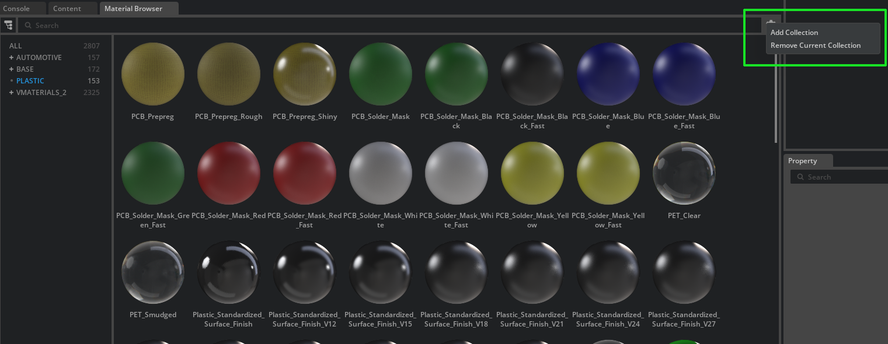

# NVIDIA PhysicalAI-SimReady-Materials

Welcome to the **NVIDIA PhysicalAI-SimReady-Materials** repository! This library contains an extensive collection of UsdShade-based materials that leverage OpenPBR v1.1 to provide high-quality, physically-based rendering (PBR) looks. These materials can be used in NVIDIA Omniverse™ as well as a wide range of other DCC (Digital Content Creation) applications that support USD and MaterialX.

## Table of Contents

- [NVIDIA PhysicalAI-SimReady-Materials](#nvidia-physicalai-simready-materials)
  - [Table of Contents](#table-of-contents)
  - [1. Overview](#1-overview)
    - [Key Features](#key-features)
  - [2. Repository Structure](#2-repository-structure)
  - [3. Categories and Material Count](#3-categories-and-material-count)
  - [4. Dependencies and Requirements](#4-dependencies-and-requirements)
  - [5. Installation and Usage](#5-installation-and-usage)
  - [6. Material Inheritance](#6-material-inheritance)
  - [7. Working with Omniverse](#7-working-with-omniverse)
  - [8. Using in Other DCCs](#8-using-in-other-dccs)
  - [9. Contributing](#9-contributing)
  - [10. License](#10-license)
  - [11. Acknowledgments](#11-acknowledgments)
  - [12. Contact](#12-contact)

---

## 1. Overview

This repository provides a set of high-quality materials distilled from NVIDIA's [vMaterials](https://developer.nvidia.com/vmaterials) collection. The materials here are structured into categories, each containing multiple variations. All materials are authored in USD, specifically in `UsdShade`, and adhere to the [OpenPBR v1.1 specification](https://github.com/AcademySoftwareFoundation/OpenPBR/tree/v1.1).

### Key Features

- **Massive Collection**: Multiple material categories for industrial and manufacturing.  
- **High Quality**: Materials based on vMaterials, known for production-ready, physically plausible looks.  
- **OpenPBR-based**: Fully compliant with the [OpenPBR v1.1](https://github.com/AcademySoftwareFoundation/OpenPBR/tree/v1.1) standard.  
- **Universal**: Each material is authored in USD (`UsdShade`) and can be used across various DCC applications.  
- **Texture Support**: All texture files are in `.jpg` format for efficient size and broad compatibility.

---

## 2. Repository Structure

```bash
├── PhysicalAI-SimReady-Materials
|   ├── open_pbr_uber_base_class.usda  # Root base class defining the OpenPBR material schema
|   ├── Materials  # Material files
│       ├── Carpet
│       |   ├── Carpet_Woven.usda
│       |   ├── textures
│       |   |   ├── Carpet_Woven_normal.jpg
│       |   |   └── ... 
│       |   └── ...
│       ├── Ceramic
│       |   ├── Ceramic_Tiles_Diamond_Antique_White.usda
│       |   ├── textures
│       |   |   └── ... 
│       |   └── ...
│       │
│       ├── Composite
│       |   └── ...
│       └── Concrete
|           └── ...
|
|
└── LICENSE.md
|           
└── README.md 
|           
└── SECURITY.md 
```

---

## 3. Categories and Material Count

This library includes thousands of materials distributed across the following multiple categories. Given the impracticality of hosting such large files in one Github repository, each material category is provided as a separate, downloadable Asset from the [Release page](https://github.com/NVIDIA-Omniverse/PhysicalAI-SimReady-Materials/releases/latest).

1. Carpet
2. Ceramic
3. Concrete
4. Glass
5. Ground
6. Leather
7. Liquids
8. Masonry
9. Metal
10. Paint
11. Paper
12. Plastic
13. Stone

---

## 4. Dependencies and Requirements

- **[OpenPBR 1.1](https://github.com/AcademySoftwareFoundation/OpenPBR/tree/v1.1)**  
- **[OpenUSD 24.08](https://github.com/PixarAnimationStudios/OpenUSD/tree/v24.08)**
- **[MaterialX 1.38.10-OpenPBR](https://github.com/AcademySoftwareFoundation/MaterialX/tree/v1.38.10-OpenPBR)**  
  
---

## 5. Installation and Usage

Download the individual material categories from the above links into a subdirectory of the project, such as `PhysicalAI-SimReady-Material`.

Individual materials are stored in the sub-folder `Materials`, where they can be referenced into your USD Stage. 

If you are adding this library to the [Omniverse Material Browser Extension](https://docs.omniverse.nvidia.com/extensions/latest/ext_core/ext_browser-extensions/material-browser.html), you can add folders to the list of Browser Collections.

<div align="center">
  
</div>

<br>

⚠️ When migrating data, please note that materials inherit from `open_pbr_uber_base_class.usda`. It is therefore expected that when migrating any files, you move the entire material package to its new destination and reference your USD data from the root of the package.

---

## 6. Material Inheritance

All materials inherit from `open_pbr_uber_base_class.usda` for consistency and efficiency. This makes it easy to maintain and update the base material properties as things change in the OpenPBR specification.

### Base Class Structure

The `open_pbr_uber_base_class.usda` file defines a comprehensive OpenPBR v1.1 material class with the following key components:

#### **Material Attributes**
The class defines material input attributes organized into logical groups:

- **Base**: 
    - base_weight
    - base_color
    - base_diffuse_roughness
    - base_metalness

- **Specular**: 
    - specular_weight
    - specular_color
    - specular_roughness
    - specular_ior
    - specular_roughness_anisotropy

- **Transmission**: 
    - transmission_weight
    - transmission_color
    - transmission_depth
    - transmission_scatter
    - transmission_dispersion_scale
    - transmission_abbe_number

- **Subsurface**: 
    - subsurface_weight
    - subsurface_color
    - subsurface_radius
    - subsurface_radius_scale
    - subsurface_scatter_anisotropy

- **Fuzz**: 
    - fuzz_weight
    - fuzz_color
    - fuzz_roughness

- **Coat**: 
    - coat_weight
    - coat_color
    - coat_roughness
    - coat_ior
    - coat_darkening
    - coat_roughness_anisotropy
    - coat_normal_scale

- **Thin Film**: 
    - thin_film_weight
    - thin_film_ior
    - thin_film_thickness

- **Emission**: 
    - emission_luminance
    - emission_color

- **Geometry**: 
    - geometry_opacity
    - geometry_thin_walled
    - geometry_normal_scale

- **UV Controls**: 
    - uvtiling
    - uvoffset

#### **Shader Graph**
The material implements a complete MaterialX UsdShade Shader graph using OpenPBR Surface Shader as it's material model, with additional support for:

- **Texture Mapping**: For many parameters we support mapping the input to a texture resource. `ND_tiledimage_<type>` nodes connect to inputs with UV tiling/offset support.
- **Normal Mapping**: The graph has dedicated normal map processing with flip controls for R/G/B channels to conveniently switch between DirectX and OpenGL encoded mappings.

<div align="center">
  
</div>

<br>

#### **Semantic Labels**
The class includes semantic metadata for material identification:
- `semantics:labels:material = ["base"]`
- `semantics:labels:OpenPBR_Ver = ["1.1"]`
- `semantics:labels:vMaterial_Ver = ["2.2"]`

#### **Non-Visual Sensor Attributes**
These attributes enable the simulation of non-visual sensors like Lidar, RADAR, and Ultrasonic systems by providing material properties that affect sensor response outside the visible spectrum. It allows the RTX renderer in NVIDIA Omniverse to accurately simulate sensor behavior through base material properties, surface coatings, and special attributes like retroreflectivity.

- **omni:simready:nonvisual:base**
- **omni:simready:nonvisual:coating**
- **omni:simready:nonvisual:attributes**


---

## 7. Working with Omniverse
The library is intended as a stand along library on your file system or Nucleus installation. To use the library on Nucleus we recommend:

1. Upload the complete package to Omniverse Nucleus.  
2. Reference, Sublayer or Load Materials into your Stage.  
3. It is recommended that materias be referenced into a hierarchy, similar to `/World/Looks` or `/World/Materials` to follow best practices.
4. Like otehr material workflows in Omniverse you can Edit & author Override opinions on any material parameters.

If working with the Material Browser Extension, add the library's `Collection` folder to the list of Browser Collections.

---

## 8. Support in Other DCCs and Runtimes

- **NVIDIA Omniverse RTX in Omniverse Kit SDK and Sensor RTX API**  
- **Pixar USD**
- **Autodesk Maya**  
- **SideFX Houdini**
- **Other Tools**  

---

## 9. Contributing

Please see our [Contributing Guidelines](CONTRIBUTING.md) for information on how to contribute to this project.

---

## 10. License

The materials and textures are licensed permissively under the [MIT-0 License.](LICENSE.md)

---

## 11. Acknowledgments

- **Academy Software Foundation** for [OpenPBR](https://github.com/AcademySoftwareFoundation/OpenPBR).  
- **Academy Software Foundation** for [MaterialX](https://github.com/AcademySoftwareFoundation/MaterialX).  
- **Pixar and AOUSD** for [OpenUSD](https://aousd.org/).
- **NVIDIA** for [vMaterials](https://developer.nvidia.com/vmaterials).  
- **NVIDIA** for [Omniverse](https://www.nvidia.com/en-us/omniverse/).

---

## 12. Contact

For inquiries, open an issue in this repository or reach out via the [issue tracker](https://github.com/NVIDIA-Omniverse/PhysicalAI-SimReady-Materials/issues).

Thank you for your support.
